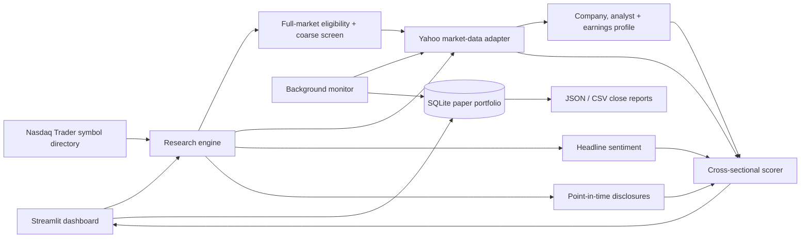

# PaperAlpha

PaperAlpha is an explainable stock-research and intraday paper-trading dashboard. It ranks a
configurable universe of liquid US stocks, sizes a virtual order from a user-provided budget,
tracks the position through the session, and writes an end-of-day profit/loss report.

The project is designed for research and software-engineering demonstration. It does not place
orders, connect to a brokerage, or present its score as a probability of profit.

## What it does

- Discovers the current US stock universe from Nasdaq Trader's live NASDAQ and other-exchange
  symbol directories; ETFs, test issues, warrants, rights, units, and preferred shares are removed.
- Pages through every stock meeting configurable price, market-cap, and average-volume thresholds,
  then deeply analyses the strongest 20–150 candidates. Custom scans accept up to 100 symbols.
- Uses 30+ inputs across momentum, trend, market-relative strength, quality, value, analyst
  consensus, news, risk, entry setup, liquidity, volume, earnings timing, and dated disclosures.
- Shows the top paper idea, ticker symbol, reference price, share quantity, unused cash, model
  score, signal strength, factor attribution, warnings, and recent headlines.
- Reprices the order at entry and refuses to invent an executable price when the NYSE is closed.
- Uses the official NYSE calendar, including holidays and early closes.
- Persists positions and one-minute snapshots in SQLite.
- Automatically closes each paper position at that session's official closing price.
- Generates JSON and CSV end-of-day reports.
- Sends optional iPhone watchlist, paper-entry, progress, and closing P/L notifications through
  ntfy, with a one-command automated paper-trading day runner.
- Includes a two-year walk-forward test with next-session execution and configurable costs.
- Keeps market-data, scoring, storage, and presentation code independently replaceable.

## Architecture



`YahooMarketData` is an adapter, not a dependency spread through the codebase. A licensed or
broker-provided feed can replace it without rewriting the factor model or dashboard.

## Scoring model

| Factor | Weight | Input |
|---|---:|---|
| Momentum | 16% | Adjusted 5-, 20-, 60-, and 120-session returns |
| Trend | 12% | 20/50/200-day averages and MACD histogram |
| Quality | 13% | Revenue/EPS growth, ROE, margins, free cash flow, leverage, current ratio |
| News | 11% | Recency-weighted VADER sentiment from ticker-linked headlines |
| Value | 9% | Forward/trailing earnings yield and book yield |
| Risk | 9% | Volatility, downside volatility, ATR, drawdown, beta, and short float |
| Market | 8% | SPY-relative returns, rolling beta, correlation, and market regime |
| Analyst | 8% | Consensus rating, target-price upside, and number of analysts |
| Setup | 5% | RSI and Bollinger-position entry quality |
| Liquidity | 4% | Average dollar volume and Amihud illiquidity |
| Volume | 3% | Five-day volume relative to 20-day volume, signed by price direction |
| Earnings event | 1% | Proximity to the next reported earnings date |
| Public traders | 1% | Recency- and size-weighted disclosed buys and sells |

Comparable inputs are converted into robust cross-sectional scores with the median and median
absolute deviation. This makes the result a ranking **within the deep-analysis set**. A score of
70 means stronger relative evidence than 50; it does not mean a 70% chance of making money.

Missing fundamentals, analyst data, news, or disclosures receive neutral component scores and
lower signal strength. The dashboard shows those coverage gaps rather than silently treating
missing data as positive.

The broad scan is intentionally two-stage. It evaluates the full eligible screen using inexpensive
quote-level fields, then downloads one year of history and richer profiles only for the configured
deep-analysis count. This keeps a free research feed usable without claiming that thousands of
simultaneous detailed requests would be reliable.

## Quick start

Python 3.11 or newer is required.

```bash
git clone https://github.com/tiraaamisuuu/Stocks.git
cd Stocks
python -m venv .venv
```

Activate the environment:

```powershell
# Windows PowerShell
.\.venv\Scripts\Activate.ps1
```

```bash
# macOS / Linux
source .venv/bin/activate
```

Install and run:

```bash
python -m pip install -e .
streamlit run app.py
```

The dashboard opens at `http://localhost:8501`. Run a scan at any time. The **Start paper trade**
button is enabled only during the regular NYSE session so the entry price is reproducible.

## Windows executable

The repository includes a reproducible PyInstaller build that creates a single `PaperAlpha.exe`.
On Windows PowerShell:

```powershell
.\scripts\build_windows.ps1
```

The result is written to `dist\PaperAlpha.exe`. Double-clicking it starts a local dashboard and
opens the default browser; no system-wide Python installation is needed on the destination PC.
The first launch can take several seconds because the one-file package extracts its runtime.

Packaged runtime data is kept outside the temporary executable bundle:

```text
%LOCALAPPDATA%\PaperAlpha\paperalpha.db
%LOCALAPPDATA%\PaperAlpha\trader_signals.csv
%LOCALAPPDATA%\PaperAlpha\reports\
```

The executable is not digitally signed, so Windows SmartScreen may show an unknown-publisher
warning. A code-signing certificate is required to remove that warning for public distribution.
GitHub Actions also builds the executable and stores it as a `PaperAlpha-Windows` workflow
artifact for 14 days.

## Unattended intraday tracking

The Live book refreshes while the dashboard is open. For tracking that continues independently
of browser interaction, leave this command running in a second terminal:

```bash
paperalpha-monitor --interval 60
```

For a scheduler or health check, perform a single polling cycle with:

```bash
paperalpha-monitor --once
```

Runtime data is stored under `state/` and intentionally excluded from Git. When a session closes,
the monitor saves `state/reports/YYYY-MM-DD.json` and `.csv`.

## iPhone alerts and one-day automation

For a controlled buy-at-open/sell-at-close paper experiment, install the
[ntfy iOS app](https://apps.apple.com/app/ntfy/id1625396347), then run this on the always-on laptop:

```powershell
.\scripts\start_paper_day.ps1 -Budget 1000 -Fractional
```

On first use the script generates a secret notification topic, walks through the phone
subscription, sends a connection test, and keeps running until the official closing report is
complete. The ledger prevents a restart from opening a duplicate paper position for that session.
See [the complete iPhone alert setup](docs/IPHONE_ALERTS.md) for behavior and security notes.

For an old Windows laptop that should remain online across market days, use the scheduled-task
installer instead:

```powershell
powershell -ExecutionPolicy Bypass -File .\scripts\install_windows_server.ps1 -BudgetGbp 150
```

It creates an isolated environment, walks through ntfy setup, starts PaperAlpha immediately, and
registers automatic sign-in/daily triggers with failure restarts. See the
[always-on Windows server guide](docs/SERVER_SETUP.md).

## Public trader disclosures

PaperAlpha deliberately does not scrape social-media claims or pretend that delayed filings are
live trades. Add lawful public records to [`data/trader_signals.csv`](data/trader_signals.csv),
using the timestamp when the information became public:

```csv
ticker,disclosed_at,actor,side,notional_usd,source_url
XYZ,2026-01-15T17:30:00Z,Example filer,buy,50000,https://example.com/filing
```

The sample above is illustrative, not real market data. More detail about the schema is in
[`data/README.md`](data/README.md).

## Backtesting correctly

The Model lab uses the technical sleeve only because the free provider does not include a
point-in-time archive of historical fundamentals, analyst revisions, headlines, and disclosures.
At each rebalance:

1. Features use data available through session `t`.
2. The highest-ranked ticker is selected after that close.
3. Entry occurs at session `t+1`'s open.
4. Exit occurs at a later open after the selected holding period.
5. Transaction costs are applied on both entry and exit.

This removes obvious same-close look-ahead bias. It does not eliminate survivorship bias,
selection bias, market impact, slippage uncertainty, or overfitting. A positive backtest is a
research result, not evidence of future performance.

## Tests and code quality

```bash
python -m pip install -e ".[dev]"
ruff check src tests app.py
ruff format --check src tests app.py
pytest --cov=paperalpha --cov-report=term-missing
```

The deterministic tests cover factor behavior, future-information exclusion, dated disclosures,
NYSE session status, position accounting, monitor-driven closing reports, ticker-specific news
filtering, and next-session backtest execution. Network access is not required by the test suite.

## Project layout

```text
app.py                         Streamlit UI
src/paperalpha/
  market_data.py              Provider boundary and ticker-linked news parsing
  universe.py                 Live US listing directory, filters, and stale-on-error cache
  scoring.py                  Point-in-time features and cross-sectional ranking
  sentiment.py                Recency-weighted financial headline sentiment
  trader_signals.py           Public-disclosure ingestion and decay
  storage.py                  SQLite positions and snapshots
  market_clock.py             NYSE sessions, holidays, and closes
  monitor.py                  Background polling and automatic close
  notifications.py            ntfy configuration and iPhone message delivery
  day_trader.py                One-position session automation state machine
  reporting.py                End-of-day JSON/CSV reports
  backtest.py                 Walk-forward price-factor evaluation
tests/                         Deterministic unit and integration tests
```

## Data and risk limitations

- [`yfinance`](https://ranaroussi.github.io/yfinance/) uses Yahoo's publicly available interfaces,
  is not affiliated with Yahoo, and documents its data as intended for research/personal use.
- Free quotes may be delayed, corrected, incomplete, or temporarily unavailable.
- Headline sentiment does not understand every context, sarcasm, rumor, or event impact.
- Public investor and insider disclosures are delayed by definition.
- The live universe comes from the current
  [Nasdaq Trader symbol directory](https://www.nasdaqtrader.com/trader.aspx?id=symboldirdefs),
  so historical tests are not survivorship-bias-free.
- Paper execution excludes liquidity constraints, partial fills, spreads, taxes, and realistic
  market impact.

Use a licensed point-in-time feed and a carefully defined out-of-sample protocol before treating
the project as serious quantitative research. This software is educational and is not financial
advice.

## License

MIT — see [`LICENSE`](LICENSE).
