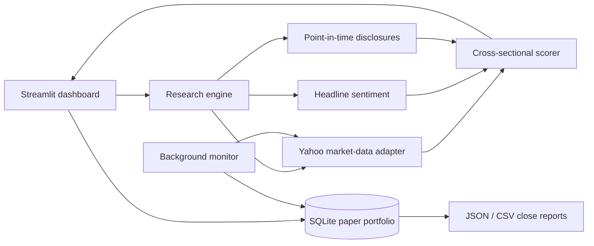

# PaperAlpha

PaperAlpha is an explainable stock-research and intraday paper-trading dashboard. It ranks a
configurable universe of liquid US stocks, sizes a virtual order from a user-provided budget,
tracks the position through the session, and writes an end-of-day profit/loss report.

The project is designed for research and software-engineering demonstration. It does not place
orders, connect to a brokerage, or present its score as a probability of profit.

## What it does

- Ranks 2–30 ticker symbols using momentum, trend, risk, volume, recent-news tone, and dated
  public-disclosure signals.
- Shows the top paper idea, ticker symbol, reference price, share quantity, unused cash, model
  score, signal strength, factor attribution, warnings, and recent headlines.
- Reprices the order at entry and refuses to invent an executable price when the NYSE is closed.
- Uses the official NYSE calendar, including holidays and early closes.
- Persists positions and one-minute snapshots in SQLite.
- Automatically closes each paper position at that session's official closing price.
- Generates JSON and CSV end-of-day reports.
- Includes a two-year walk-forward test with next-session execution and configurable costs.
- Keeps market-data, scoring, storage, and presentation code independently replaceable.

## Architecture



`YahooMarketData` is an adapter, not a dependency spread through the codebase. A licensed or
broker-provided feed can replace it without rewriting the factor model or dashboard.

## Scoring model

| Factor | Weight | Input |
|---|---:|---|
| Momentum | 30% | Adjusted 5-, 20-, and 60-session returns |
| Trend | 20% | Price/20-day SMA and 20-day/50-day SMA relationships |
| News | 20% | Recency-weighted VADER sentiment from ticker-linked headlines |
| Risk | 15% | 20-day annualized volatility and current 60-day drawdown |
| Volume | 10% | Five-day volume relative to 20-day volume, signed by price direction |
| Public traders | 5% | Recency- and size-weighted disclosed buys and sells |

Price factors are converted into robust cross-sectional scores with the median and median
absolute deviation. This makes the result a ranking **within the selected universe**. A score of
70 means stronger relative evidence than 50; it does not mean a 70% chance of making money.

Missing news or disclosure data receives a neutral factor score and lowers signal strength. The
dashboard shows that coverage gap rather than silently treating missing data as positive.

## Quick start

Python 3.11 or newer is required.

```bash
git clone https://github.com/tiraaamisuuu/Stocks.git
cd Stocks
python -m venv .venv
```

Activate the environment:

```powershell
# Windows PowerShell
.\.venv\Scripts\Activate.ps1
```

```bash
# macOS / Linux
source .venv/bin/activate
```

Install and run:

```bash
python -m pip install -e .
streamlit run app.py
```

The dashboard opens at `http://localhost:8501`. Run a scan at any time. The **Start paper trade**
button is enabled only during the regular NYSE session so the entry price is reproducible.

## Unattended intraday tracking

The Live book refreshes while the dashboard is open. For tracking that continues independently
of browser interaction, leave this command running in a second terminal:

```bash
paperalpha-monitor --interval 60
```

For a scheduler or health check, perform a single polling cycle with:

```bash
paperalpha-monitor --once
```

Runtime data is stored under `state/` and intentionally excluded from Git. When a session closes,
the monitor saves `state/reports/YYYY-MM-DD.json` and `.csv`.

## Public trader disclosures

PaperAlpha deliberately does not scrape social-media claims or pretend that delayed filings are
live trades. Add lawful public records to [`data/trader_signals.csv`](data/trader_signals.csv),
using the timestamp when the information became public:

```csv
ticker,disclosed_at,actor,side,notional_usd,source_url
XYZ,2026-01-15T17:30:00Z,Example filer,buy,50000,https://example.com/filing
```

The sample above is illustrative, not real market data. More detail about the schema is in
[`data/README.md`](data/README.md).

## Backtesting correctly

The Model lab uses only historical price factors because the free provider does not include a
point-in-time archive of every headline and disclosure. At each rebalance:

1. Features use data available through session `t`.
2. The highest-ranked ticker is selected after that close.
3. Entry occurs at session `t+1`'s open.
4. Exit occurs at a later open after the selected holding period.
5. Transaction costs are applied on both entry and exit.

This removes obvious same-close look-ahead bias. It does not eliminate survivorship bias,
selection bias, market impact, slippage uncertainty, or overfitting. A positive backtest is a
research result, not evidence of future performance.

## Tests and code quality

```bash
python -m pip install -e ".[dev]"
ruff check src tests app.py
ruff format --check src tests app.py
pytest --cov=paperalpha --cov-report=term-missing
```

The deterministic tests cover factor behavior, future-information exclusion, dated disclosures,
NYSE session status, position accounting, monitor-driven closing reports, ticker-specific news
filtering, and next-session backtest execution. Network access is not required by the test suite.

## Project layout

```text
app.py                         Streamlit UI
src/paperalpha/
  market_data.py              Provider boundary and ticker-linked news parsing
  scoring.py                  Point-in-time features and cross-sectional ranking
  sentiment.py                Recency-weighted financial headline sentiment
  trader_signals.py           Public-disclosure ingestion and decay
  storage.py                  SQLite positions and snapshots
  market_clock.py             NYSE sessions, holidays, and closes
  monitor.py                  Background polling and automatic close
  reporting.py                End-of-day JSON/CSV reports
  backtest.py                 Walk-forward price-factor evaluation
tests/                         Deterministic unit and integration tests
```

## Data and risk limitations

- [`yfinance`](https://ranaroussi.github.io/yfinance/) uses Yahoo's publicly available interfaces,
  is not affiliated with Yahoo, and documents its data as intended for research/personal use.
- Free quotes may be delayed, corrected, incomplete, or temporarily unavailable.
- Headline sentiment does not understand every context, sarcasm, rumor, or event impact.
- Public investor and insider disclosures are delayed by definition.
- The current universe is not a complete or survivorship-bias-free market history.
- Paper execution excludes liquidity constraints, partial fills, spreads, taxes, and realistic
  market impact.

Use a licensed point-in-time feed and a carefully defined out-of-sample protocol before treating
the project as serious quantitative research. This software is educational and is not financial
advice.

## License

MIT — see [`LICENSE`](LICENSE).
